# 数据中心管理平台 - 架构设计文档

> 📅 更新时间：2024-12-11  
> 👤 作者：向习文  
> 📌 版本：v1.0.0

---

## 📋 目录

- [1. 项目概述](#1-项目概述)
- [2. 技术选型](#2-技术选型)
- [3. 整体架构](#3-整体架构)
- [4. 目录结构](#4-目录结构)
- [5. 核心模块设计](#5-核心模块设计)
- [6. 数据流架构](#6-数据流架构)
- [7. 路由与权限](#7-路由与权限)
- [8. 组件架构](#8-组件架构)
- [9. 状态管理](#9-状态管理)
- [10. 工程化配置](#10-工程化配置)

---

## 1. 项目概述

**数据中心管理平台**是一个基于 React 的企业级中后台管理系统，采用现代化的前端技术栈，提供高效、可扩展的开发体验。

### 1.1 核心特性

| 特性              | 说明                           |
| ----------------- | ------------------------------ |
| 🚀 **开箱即用**   | 基于 UmiJS Max，内置最佳实践   |
| 📦 **组件复用**   | 封装通用业务组件，提升开发效率 |
| 🔐 **权限控制**   | 完善的路由级别权限管理         |
| 🎨 **UI 规范**    | 基于 Ant Design 5.x 设计体系   |
| 📊 **数据可视化** | 集成 ECharts 图表能力          |
| 🔄 **状态管理**   | Zustand 轻量级状态管理方案     |
| 🔀 **流程编排**   | React Flow 可视化流程编辑器    |
| ✏️ **代码编辑**   | Monaco Editor 专业代码编辑器   |

---

## 2. 技术选型

### 2.1 技术栈全景图

```
┌─────────────────────────────────────────────────────────────────┐
│                        数据中心管理平台                           │
├─────────────────────────────────────────────────────────────────┤
│  视图层        │  React 18 + TypeScript                         │
├─────────────────────────────────────────────────────────────────┤
│  UI 框架       │  Ant Design 5.x + Ant Design Pro Components    │
├─────────────────────────────────────────────────────────────────┤
│  样式方案      │  TailwindCSS + Less Modules                    │
├─────────────────────────────────────────────────────────────────┤
│  状态管理      │  Zustand (persist middleware)                  │
├─────────────────────────────────────────────────────────────────┤
│  请求层        │  @umijs/max request + ahooks useRequest        │
├─────────────────────────────────────────────────────────────────┤
│  路由管理      │  UmiJS 约定式/配置式路由                        │
├─────────────────────────────────────────────────────────────────┤
│  图表可视化    │  ECharts 6.x                                   │
├─────────────────────────────────────────────────────────────────┤
│  工程化        │  UmiJS Max + ESLint + Prettier + Husky         │
└─────────────────────────────────────────────────────────────────┘
```

### 2.2 核心依赖

```json
{
  "dependencies": {
    "@umijs/max": "^4.6.4", // 企业级框架
    "antd": "^5.4.0", // UI 组件库
    "zustand": "^5.0.9", // 状态管理
    "ahooks": "^3.9.6", // React Hooks 库
    "echarts": "^6.0.0", // 图表库
    "@xyflow/react": "^12.9.3", // 流程图
    "@monaco-editor/react": "^4.7.0" // 代码编辑器
  }
}
```

### 2.3 技术选型理由

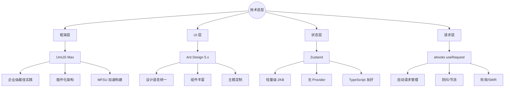

---

## 3. 整体架构

### 3.1 分层架构图

```
┌───────────────────────────────────────────────────────────────────────┐
│                              用户界面层                                │
│  ┌─────────────┐  ┌─────────────┐  ┌─────────────┐  ┌─────────────┐  │
│  │    Pages    │  │   Layouts   │  │ Components  │  │    Hooks    │  │
│  │   (页面)    │  │   (布局)    │  │   (组件)    │  │  (自定义)   │  │
│  └──────┬──────┘  └──────┬──────┘  └──────┬──────┘  └──────┬──────┘  │
└─────────┼────────────────┼────────────────┼────────────────┼──────────┘
          │                │                │                │
          ▼                ▼                ▼                ▼
┌───────────────────────────────────────────────────────────────────────┐
│                              业务逻辑层                                │
│  ┌─────────────────────────┐    ┌─────────────────────────────────┐  │
│  │        Stores           │    │           Services              │  │
│  │   (Zustand 状态管理)    │    │      (API 请求服务)             │  │
│  │  ┌───────┐ ┌───────┐   │    │  ┌─────────┐  ┌─────────┐      │  │
│  │  │ user  │ │  app  │   │    │  │  user   │  │analysis │      │  │
│  │  └───────┘ └───────┘   │    │  └─────────┘  └─────────┘      │  │
│  └─────────────────────────┘    └─────────────────────────────────┘  │
└───────────────────────────────────────────────────────────────────────┘
          │                                    │
          ▼                                    ▼
┌───────────────────────────────────────────────────────────────────────┐
│                              基础设施层                                │
│  ┌────────────┐  ┌────────────┐  ┌────────────┐  ┌────────────────┐  │
│  │   Utils    │  │ Constants  │  │   Types    │  │    Request     │  │
│  │  (工具)    │  │   (常量)   │  │   (类型)   │  │   (请求封装)   │  │
│  └────────────┘  └────────────┘  └────────────┘  └────────────────┘  │
└───────────────────────────────────────────────────────────────────────┘
          │
          ▼
┌───────────────────────────────────────────────────────────────────────┐
│                              配置层                                    │
│  ┌────────────┐  ┌────────────┐  ┌────────────┐  ┌────────────────┐  │
│  │ config.ts  │  │ routes.ts  │  │ config.dev │  │  config.prod   │  │
│  │  (主配置)  │  │  (路由)    │  │  (开发)    │  │    (生产)      │  │
│  └────────────┘  └────────────┘  └────────────┘  └────────────────┘  │
└───────────────────────────────────────────────────────────────────────┘
```

### 3.2 模块交互图

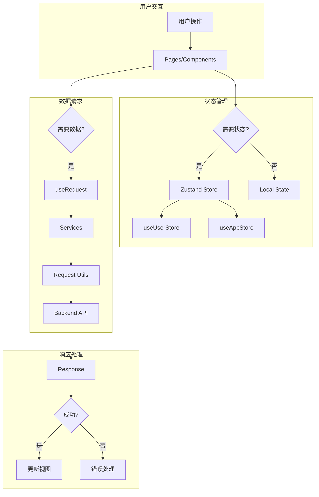

---

## 4. 目录结构

### 4.1 项目结构总览

```
data-center-manager/
├── 📁 config/                    # 🔧 配置文件
│   ├── config.ts                 #    主配置（所有环境共享）
│   ├── config.dev.ts             #    开发环境配置
│   ├── config.test.ts            #    测试环境配置
│   ├── config.prod.ts            #    生产环境配置
│   └── routes.ts                 #    路由配置
│
├── 📁 mock/                      # 🎭 Mock 数据
│   ├── user.ts                   #    用户相关 Mock
│   └── analysis.ts               #    分析相关 Mock
│
├── 📁 src/                       # 📦 源代码
│   ├── 📁 components/            #    🧩 公共组件
│   │   ├── CodeEditor/           #       代码编辑器 (Monaco)
│   │   ├── ErrorBoundary/        #       错误边界
│   │   ├── PageContainer/        #       页面容器
│   │   ├── SearchForm/           #       查询表单
│   │   └── index.ts              #       统一导出
│   │
│   ├── 📁 constants/             #    📌 常量定义
│   │   └── index.ts              #       全局常量
│   │
│   ├── 📁 hooks/                 #    🪝 自定义 Hooks
│   │   ├── useAppMessage.ts      #       消息提示 Hook
│   │   ├── useChart.ts           #       ECharts Hook
│   │   ├── useDownload.ts        #       文件下载 Hook
│   │   └── index.ts              #       统一导出
│   │
│   ├── 📁 layouts/               #    📐 布局组件
│   │   ├── BasicLayout.tsx       #       基础布局
│   │   └── BasicLayout.less      #       布局样式
│   │
│   ├── 📁 pages/                 #    📄 页面组件
│   │   ├── Auth/                 #       认证模块
│   │   │   └── Login/            #          登录页
│   │   ├── Dashboard/            #       工作台模块
│   │   │   ├── Analysis/         #          数据分析
│   │   │   └── Workplace/        #          流程编辑器
│   │   ├── System/               #       系统管理模块
│   │   │   └── Settings/         #          系统设置
│   │   └── Exception/            #       异常页面
│   │       └── 404/              #          404 页面
│   │
│   ├── 📁 services/              #    🔌 API 服务
│   │   ├── user.ts               #       用户服务
│   │   ├── analysis.ts           #       分析服务
│   │   └── index.ts              #       统一导出
│   │
│   ├── 📁 stores/                #    🗃️ 状态管理
│   │   ├── user.ts               #       用户状态
│   │   ├── app.ts                #       应用状态
│   │   └── index.ts              #       统一导出
│   │
│   ├── 📁 types/                 #    📝 类型定义
│   │   └── index.ts              #       通用类型
│   │
│   ├── 📁 utils/                 #    🛠️ 工具函数
│   │   ├── request.ts            #       请求封装
│   │   ├── storage.ts            #       存储封装
│   │   ├── format.ts             #       格式化工具
│   │   └── index.ts              #       统一导出
│   │
│   ├── 📁 wrappers/              #    🔒 路由包装器
│   │   └── auth.tsx              #       鉴权包装器
│   │
│   ├── access.ts                 #    🔑 权限配置
│   ├── app.tsx                   #    🚀 运行时配置
│   ├── global.less               #    🎨 全局样式
│   └── loading.tsx               #    ⏳ 加载组件
│
├── 📄 package.json               # 📋 项目配置
├── 📄 tsconfig.json              # ⚙️ TypeScript 配置
├── 📄 tailwind.config.js         # 🎨 Tailwind 配置
└── 📄 README.md                  # 📖 项目文档
```

### 4.2 模块职责

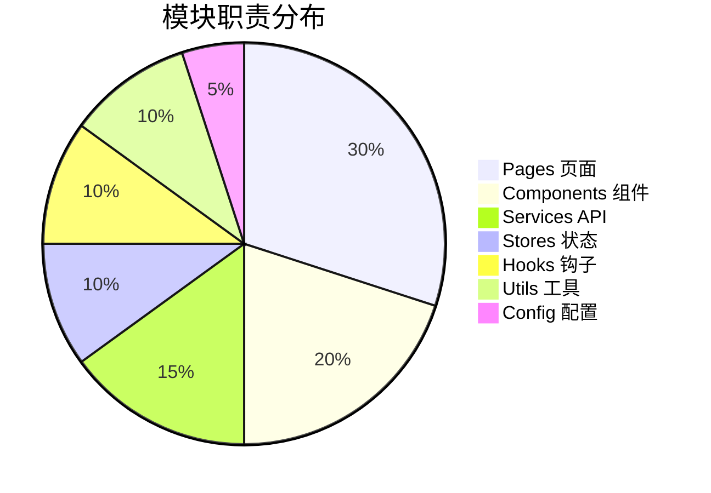

---

## 5. 核心模块设计

### 5.1 请求模块 (Request)

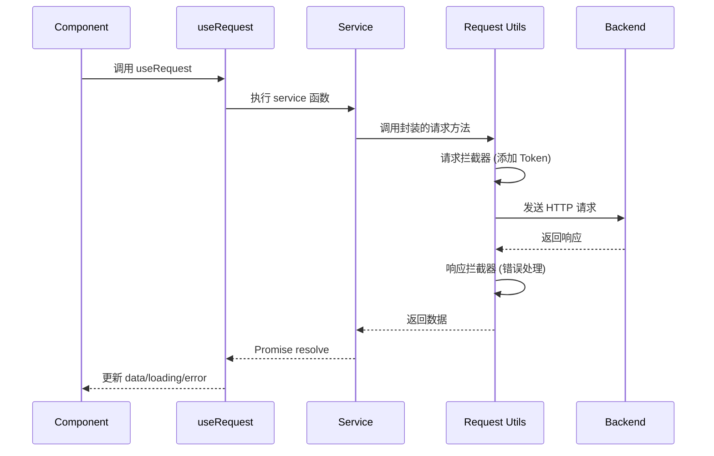

**请求封装核心代码：**

```typescript
// src/utils/request.ts
const requestInterceptors = [
  (config) => {
    const token = localStorage.getItem('token');
    if (token) {
      config.headers.Authorization = `Bearer ${token}`;
    }
    return config;
  }
];

export const requestConfig = {
  timeout: 3000,
  requestInterceptors,
  responseInterceptors,
  errorConfig
};
```

### 5.2 状态管理模块 (Stores)

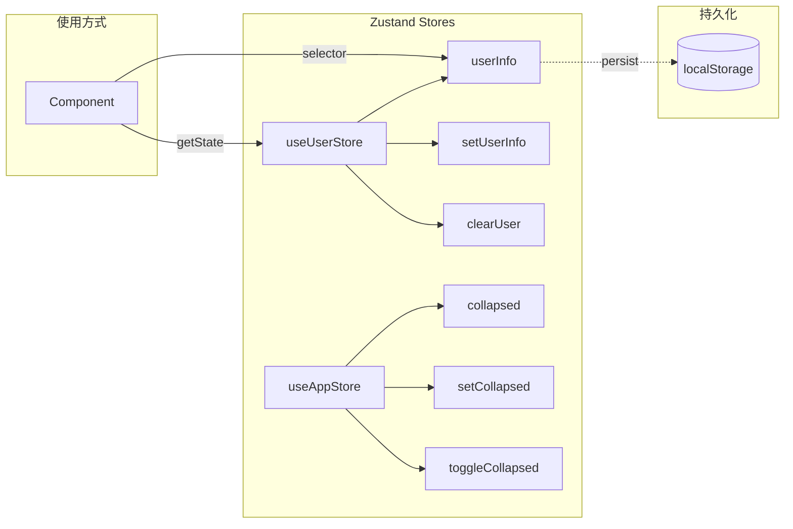

**状态管理核心设计：**

```typescript
// 类型分离设计
interface UserState {
  userInfo: UserInfo | null;
}

interface UserActions {
  setUserInfo: (userInfo: UserInfo | null) => void;
  clearUser: () => void;
}

type UserStore = UserState & UserActions;

// 持久化 + Selector 模式
export const useUserStore = create<UserStore>()(
  persist(
    (set) => ({
      userInfo: null,
      setUserInfo: (userInfo) => set({ userInfo }),
      clearUser: () => set({ userInfo: null })
    }),
    { name: 'userInfo' }
  )
);
```

### 5.3 组件模块 (Components)

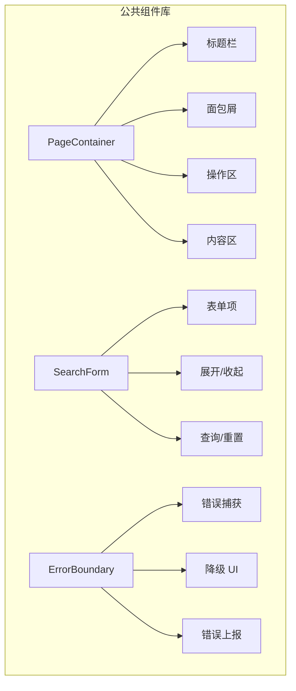

**组件使用示例：**

```tsx
<PageContainer
  title="数据分析"
  subTitle="实时数据监控"
  breadcrumb={[{ title: '首页', path: '/' }, { title: '数据分析' }]}
  extra={<Button type="primary">操作</Button>}
  onRefresh={refresh}
>
  <SearchForm onSearch={handleSearch} columns={4}>
    <Form.Item name="name" label="姓名">
      <Input />
    </Form.Item>
  </SearchForm>
</PageContainer>
```

### 5.4 Hooks 模块

| Hook            | 用途     | 核心能力                     |
| --------------- | -------- | ---------------------------- |
| `useAppMessage` | 全局消息 | 在任何位置调用 message/modal |
| `useChart`      | 图表管理 | ECharts 初始化、resize、销毁 |
| `useDownload`   | 文件下载 | 下载状态管理、错误处理       |

### 5.5 流程编辑器模块 (Workplace)

基于 React Flow 构建的可视化 ETL 流程编排工具。

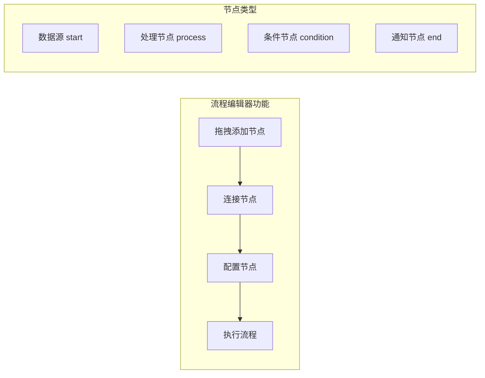

**核心特性：**

| 特性            | 说明                        |
| --------------- | --------------------------- |
| 🎯 **拖拽编排** | 从工具栏拖拽节点到画布      |
| 🔗 **连线配置** | 可视化连接节点构建数据流    |
| ⚙️ **节点配置** | 点击节点打开配置抽屉        |
| 📝 **代码编辑** | Monaco Editor 编辑 SQL/脚本 |
| 🔀 **条件分支** | 支持条件判断和分支执行      |
| ▶️ **流程执行** | 可视化展示执行状态          |

**节点配置示例：**

```typescript
// 处理节点配置
{
  label: '数据抽取',
  nodeType: 'process',
  timeout: 300,
  retryCount: 3,
  script: 'SELECT * FROM orders WHERE ...'
}

// 条件节点配置
{
  label: '质量检查',
  nodeType: 'condition',
  expression: 'data.errorRate < 0.05',
  trueBranch: 'dedup',    // 通过时执行
  falseBranch: 'alert'    // 异常时执行
}
```

**执行流程（支持条件分支）：**

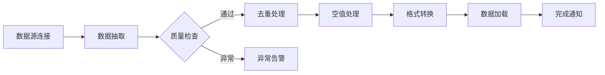

### 5.6 代码编辑器组件 (CodeEditor)

基于 Monaco Editor 封装的代码编辑器组件。

**支持特性：**

- ✅ 多语言语法高亮（SQL、JavaScript、JSON、Python、Shell）
- ✅ 深色主题
- ✅ 行号显示、代码折叠
- ✅ 全屏编辑弹窗
- ✅ 自动布局适配

**使用示例：**

```tsx
import { CodeEditor } from '@/components';

<CodeEditor
  language="sql"
  height={180}
  value={script}
  onChange={setScript}
  title="编辑执行脚本"
/>;
```

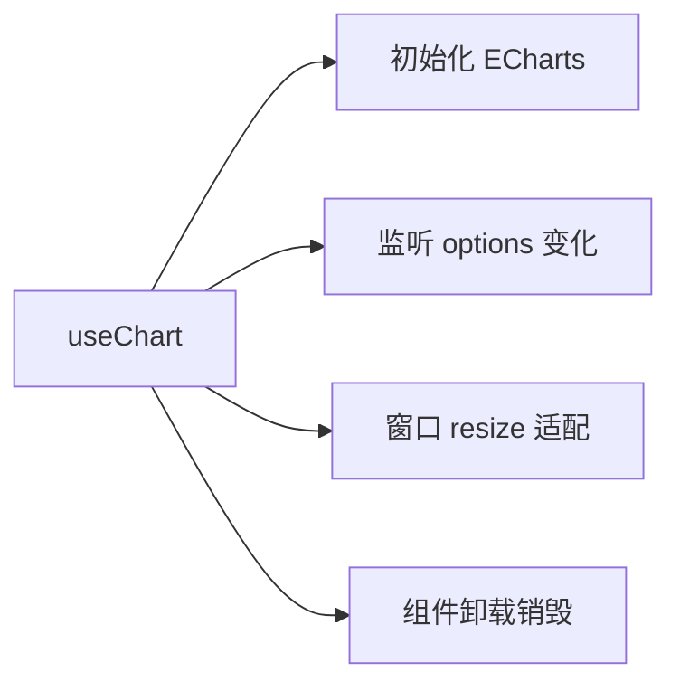

---

## 6. 数据流架构

### 6.1 单向数据流

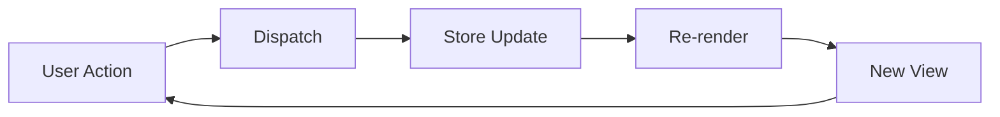

### 6.2 完整数据流示例

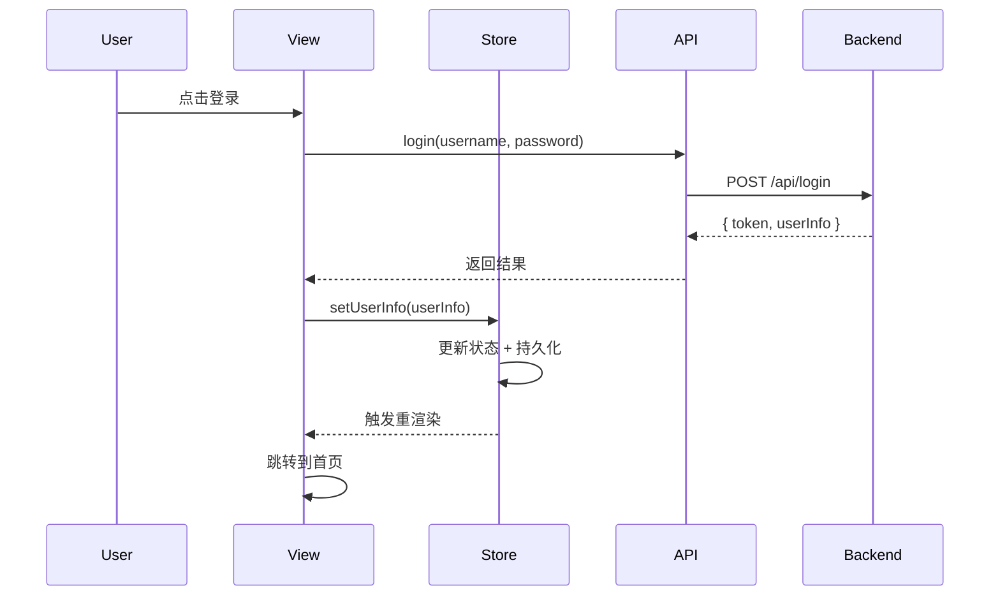

---

## 7. 路由与权限

### 7.1 动态路由架构

本项目采用**后端返回路由，前端动态渲染**的方案。

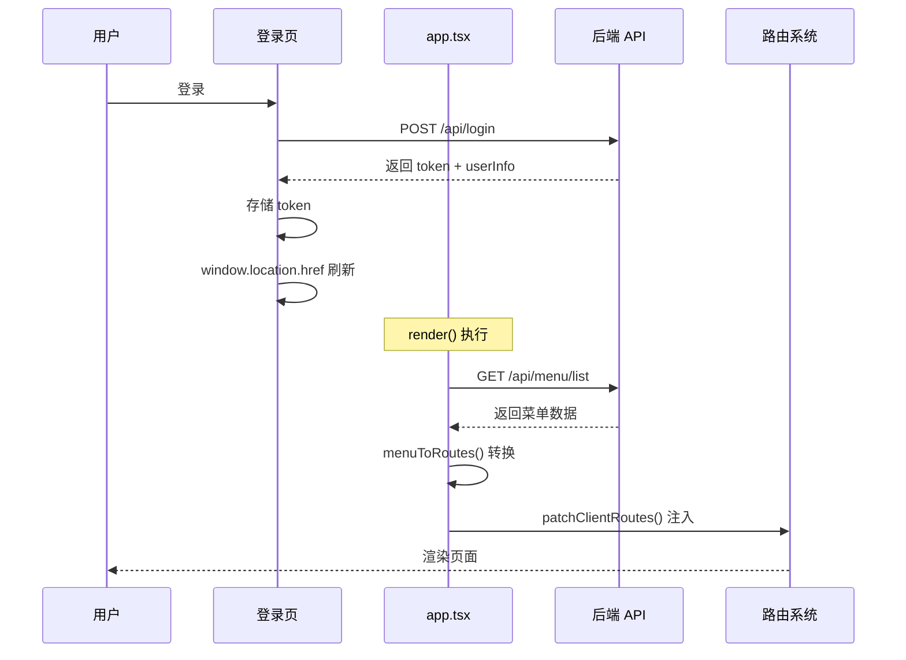

### 7.2 核心实现

**1. 基础路由配置（config/routes.ts）**

```typescript
export default [
  {
    path: '/',
    component: '@/layouts/BasicLayout',
    routes: [
      {
        path: '/',
        wrappers: ['@/wrappers/auth'],
        routes: [
          // 动态路由会注入到这里
        ]
      },
      { path: '*', component: './Exception/404' }
    ]
  },
  { path: '/login', component: './Auth/Login' }
];
```

**2. 组件映射表（src/utils/routes.tsx）**

```tsx
const componentMap: Record<string, React.ComponentType<any>> = {
  'Dashboard/Analysis': DashboardAnalysis,
  'Dashboard/Workplace': DashboardWorkplace,
  'System/Settings': SystemSettings
  // 新增页面需在此注册
};
```

**3. 动态路由注入（src/app.tsx）**

```typescript
export function patchClientRoutes({ routes }) {
  // 找到 auth wrapper 并注入动态路由
  const layoutRoute = routes.find((r) => r.path === '/');
  const authRoute = layoutRoute?.children?.find((r) => r.path === '/');
  if (authRoute) {
    authRoute.children = [...extraRoutes, ...authRoute.children];
  }
}

export function render(oldRender) {
  if (hasToken) {
    getMenus().then((res) => {
      extraRoutes = menuToRoutes(res.data);
      oldRender();
    });
  } else {
    oldRender();
  }
}
```

### 7.3 菜单权限控制

后端根据用户角色返回不同菜单，实现权限控制：

| 角色  | 可见菜单                               |
| ----- | -------------------------------------- |
| Admin | 所有菜单（工作台、系统管理、数据管理） |
| User  | 仅数据分析                             |

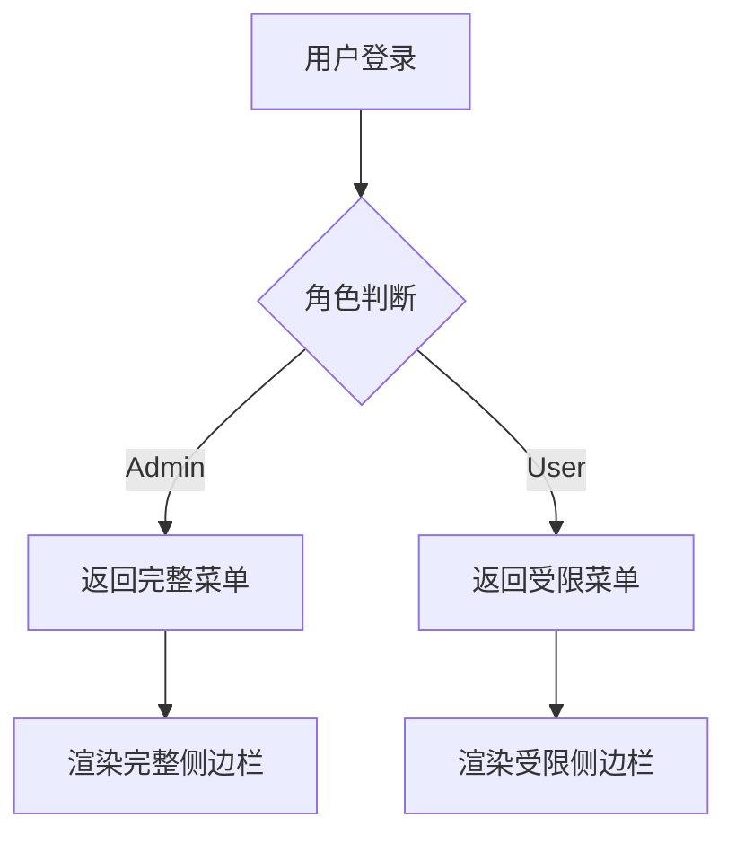

### 7.4 新增页面流程

1. **创建页面**：`src/pages/Module/Page/index.tsx`
2. **注册组件**：在 `componentMap` 中添加映射
3. **配置菜单**：后端接口返回对应菜单项

---

## 8. 组件架构

### 8.1 布局组件结构

```
┌─────────────────────────────────────────────────────────────────┐
│                         Header (固定)                            │
│  ┌──────────┐  ┌────────────────────────┐  ┌─────────────────┐  │
│  │   Logo   │  │     Module Menu        │  │   User Info     │  │
│  └──────────┘  └────────────────────────┘  └─────────────────┘  │
├─────────────────────────────────────────────────────────────────┤
│  ┌──────────┐  ┌────────────────────────────────────────────┐   │
│  │          │  │                                            │   │
│  │  Sider   │  │              Content                       │   │
│  │          │  │   ┌────────────────────────────────────┐   │   │
│  │  (菜单)  │  │   │          PageContainer            │   │   │
│  │          │  │   │  ┌─────────────────────────────┐  │   │   │
│  │          │  │   │  │        Breadcrumb          │  │   │   │
│  │          │  │   │  ├─────────────────────────────┤  │   │   │
│  │          │  │   │  │        Page Header         │  │   │   │
│  │          │  │   │  ├─────────────────────────────┤  │   │   │
│  │          │  │   │  │        Page Content        │  │   │   │
│  │          │  │   │  └─────────────────────────────┘  │   │   │
│  │          │  │   └────────────────────────────────────┘   │   │
│  │          │  │                                            │   │
│  └──────────┘  └────────────────────────────────────────────┘   │
└─────────────────────────────────────────────────────────────────┘
```

### 8.2 组件层次

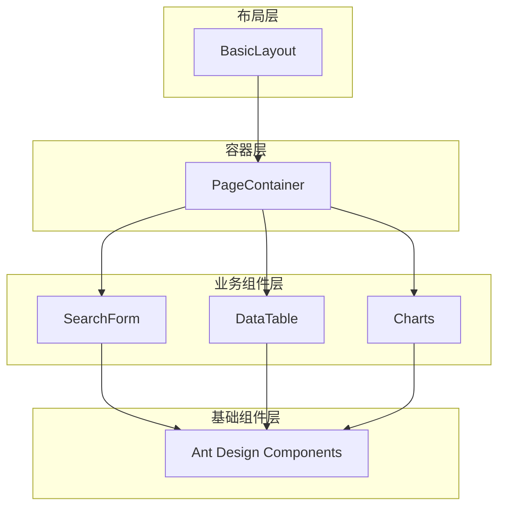

---

## 9. 状态管理

### 9.1 状态分类

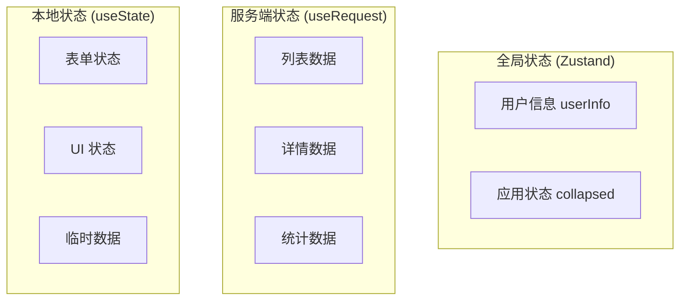

### 9.2 状态管理策略

| 状态类型   | 管理方式          | 持久化 | 示例             |
| ---------- | ----------------- | ------ | ---------------- |
| 用户认证   | Zustand + persist | ✅     | userInfo, token  |
| 应用配置   | Zustand           | ❌     | collapsed, theme |
| 服务端数据 | ahooks useRequest | ❌     | 列表、详情       |
| 表单数据   | useState / Form   | ❌     | 输入值           |
| UI 状态    | useState          | ❌     | modal visible    |

---

## 10. 工程化配置

### 10.1 构建流程

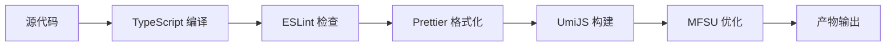

### 10.2 环境配置

```
┌─────────────────────────────────────────────────────────────┐
│                        环境配置                              │
├─────────────┬─────────────────┬─────────────────────────────┤
│    环境     │    配置文件      │        API 地址            │
├─────────────┼─────────────────┼─────────────────────────────┤
│    开发     │ config.dev.ts   │  http://localhost:8080     │
├─────────────┼─────────────────┼─────────────────────────────┤
│    测试     │ config.test.ts  │  https://test-api.xxx.com  │
├─────────────┼─────────────────┼─────────────────────────────┤
│    生产     │ config.prod.ts  │  https://api.xxx.com       │
└─────────────┴─────────────────┴─────────────────────────────┘
```

### 10.3 代码规范

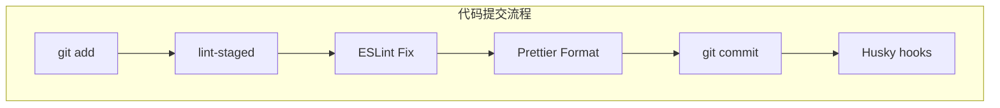

### 10.4 命令一览

```bash
# 开发
pnpm dev           # 启动开发服务器

# 构建
pnpm build         # 生产构建
pnpm build:test    # 测试环境构建
pnpm build:prod    # 生产环境构建

# 代码质量
pnpm lint          # 代码检查
pnpm format        # 代码格式化
```

---

## 📊 架构总结

### 优势

- ✅ **分层清晰**：视图层、业务层、基础层职责明确
- ✅ **类型安全**：全面使用 TypeScript，减少运行时错误
- ✅ **状态可控**：Zustand 轻量级方案，避免过度设计
- ✅ **请求规范**：useRequest + Service 层，统一管理
- ✅ **组件复用**：封装通用组件，提升开发效率
- ✅ **工程规范**：ESLint + Prettier + Husky 保证代码质量

### 架构原则

1. **单一职责**：每个模块只做一件事
2. **依赖倒置**：高层模块不依赖低层模块实现
3. **开闭原则**：对扩展开放，对修改关闭
4. **DRY 原则**：不重复自己，复用优先

---

> 📝 **文档维护**：本文档随项目迭代更新，如有疑问请联系技术负责人。
